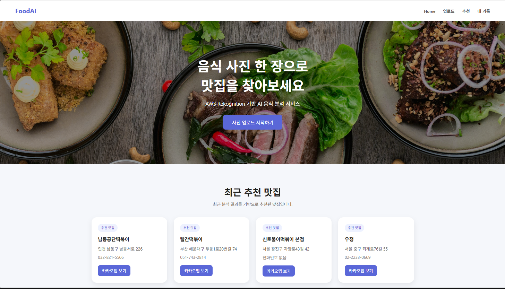
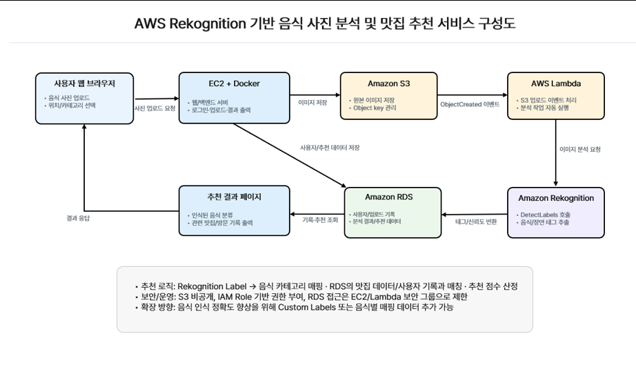
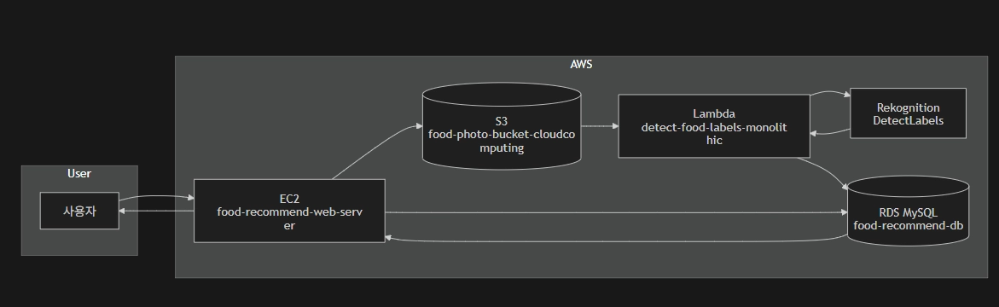
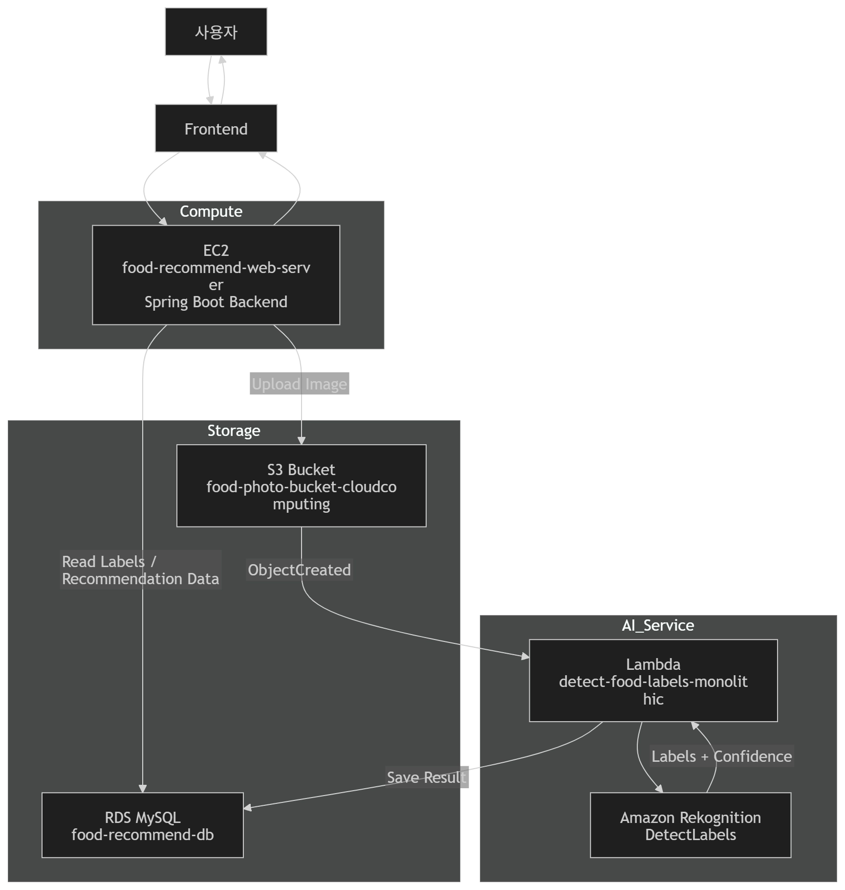

# AWS Food Recommendation Service
Cloud-based food recommendation web service using AWS Rekognition



---

# A. 프로젝트 명

AWS Rekognition 기반 음식 사진 맛집 추천 서비스

---

# B. 프로젝트 멤버 및 담당 역할

- 김도완 : Frontend(UI/UX) 개발, 웹 페이지 구성 및 API 연동
- 박영주 : Backend 서버 개발 및 추천 로직 구현 (SpringBoot API)
- 임나빈 : AWS 클라우드 인프라 구성 (EC2, S3, Lambda), Docker 배포 환경 구축

---

# C. 프로젝트 소개

본 프로젝트는 사용자가 음식 이미지를 업로드하면 AWS Rekognition을 활용하여 음식 이미지를 분석하고, 해당 결과를 기반으로 관련 맛집을 추천해주는 클라우드 기반 웹 서비스이다.

사용자는 별도의 검색어 입력 없이 이미지 업로드만으로 음식 정보를 자동으로 인식하고, 추천 결과 및 업로드 기록을 확인할 수 있다.

---

# D. 프로젝트 필요성

기존 맛집 검색 서비스는 사용자가 음식명이나 키워드를 직접 입력해야 하는 불편함이 존재한다.  

본 프로젝트는 이러한 문제를 해결하기 위해 AI 이미지 인식을 활용하여 **비언어적 입력(이미지)** 기반으로 추천 시스템을 구현하였다.

이를 통해 다음과 같은 장점이 있다:

- 검색 과정 단순화
- 사용자 경험 개선
- AI 기반 개인화 추천 가능
- 클라우드 기반 확장성 확보

---

# E. 관련 기술 / 논문 / 특허 조사

## 1. AWS Rekognition
- 이미지 내 객체 및 음식 카테고리 자동 분석
- 딥러닝 기반 CNN 모델 활용

## 2. 클라우드 기반 추천 시스템
- 사용자 행동 데이터 및 이미지 기반 추천 시스템 연구
- Amazon Personalize 및 협업 필터링 기법 참고

## 3. RESTful API 설계
- 클라이언트-서버 구조 기반 데이터 처리 방식
- JSON 기반 데이터 통신

## 4. Docker & AWS Cloud Architecture
- 컨테이너 기반 배포 환경 구성
- MSA(Micro Service Architecture) 구조 참고

---

# F. 프로젝트 개발 결과물 및 시스템 구조

## 1. 주요 기능
- 음식 이미지 업로드
- AWS Rekognition 기반 이미지 분석
- 음식 카테고리 자동 분류
- 카테고리 기반 맛집 추천
- 업로드 기록 저장 및 조회
- 결과 페이지 UI 제공

---

## 2. 시스템 아키텍처






---

# G. 개발 결과물 사용 방법 (설치 및 실행)

---

# H. 개발 결과물 활용 방안

- 음식 기반 개인 맞춤 추천 서비스
- 배달 플랫폼에서 이미지 기반 자동 추천 시스템
- 여행지 음식 추천 서비스

---

# I. AI활용

본 프로젝트에서는 AWS Rekognition을 활용하여 이미지 기반 음식 분석 기능을 구현하였다.

이를 통해 사용자가 업로드한 이미지를 자동으로 분석하고 음식 카테고리를 분류하여 추천 시스템에 활용하였다.

AI 활용 범위
AWS Rekognition 기반 이미지 분석
음식 라벨 및 카테고리 자동 추출
분석 결과 기반 추천 로직 적용

전체 코드 기준 약 20~30% 정도가 AI 기반 API 호출 및 결과 처리 로직에 해당한다.

---

# J. 담당 파트별 개발 내역 상세

# 김도완 - 프론트엔드

## 1. 프론트엔드 개발 범위

본 프로젝트의 프론트엔드는 HTML, CSS, JavaScript 기반으로 구현되었으며, AWS 기반 백엔드 API와 연동하여 사용자 인터페이스 및 데이터 시각화를 담당한다.

### 주요 구현 범위

- 음식 이미지 업로드 UI 구현
- 분석 결과 출력 페이지 구현
- 업로드 기록 조회 페이지 구현
- 추천 맛집 리스트 UI 구현
- API 연동
- LocalStorage 기반 임시 데이터 관리

---

## 2. 프론트엔드 페이지 구성

### 2-1. 메인 페이지 (index.html)
- 서비스 소개 및 네비게이션 제공
- 업로드 페이지 및 기능 접근 진입점

---

### 2-2. 업로드 페이지 (upload.html)
- 음식 이미지 업로드 기능
- 지역 입력 및 메모 입력 기능
- 서버로 데이터 전송 (POST /api/food/uploads)
- 업로드 완료 후 결과 페이지 이동 처리

---

### 2-3. 결과 페이지 (result.html)
- AWS Rekognition 분석 결과 출력
- 음식 카테고리 및 신뢰도 표시
- AI 라벨 리스트 시각화
- 추천 맛집 리스트 출력
- Kakao Map 링크 제공

---

### 2-4. 업로드 기록 페이지 (history.html)
- 사용자 업로드 기록 조회
- API 기반 데이터 리스트 출력
- 카드 형태 UI로 기록 표시
- 음식 종류, 카테고리, 메모, 시간 정보 제공

---

### 2-5. 추천 페이지 (recommend.html)
- 업로드 기반 추천 음식점 표시
- 사용자 선호 기반 추천 확장 가능 구조

---

## 3. 프론트엔드 동작 흐름

1. 사용자가 음식 이미지 및 추가 정보를 입력
2. 서버로 데이터 전송
3. 서버에서 S3 업로드 및 Rekognition 분석 수행
4. 분석 결과를 JSON 형태로 응답 받음
5. result 페이지에서 API 기반 데이터 렌더링
6. history 페이지에서 업로드 기록 조회
7. 추천 결과를 카드 UI로 시각화

---

## 4. 주요 구현 기능

---

### 4-1. 이미지 업로드 기능

- `multipart/form-data` 방식 사용
- 이미지 + 지역 + 메모 + 좌표 전송
- fetch API 기반 비동기 처리

---

### 4-2. 결과 데이터 렌더링

- localStorage 또는 API 응답 데이터 기반 UI 출력
- DOM 조작을 통한 동적 렌더링

예:
- 음식 카테고리
- 신뢰도 점수
- Rekognition 라벨 리스트
- 추천 음식점 목록

---

### 4-3. Rekognition 라벨 시각화

- AI가 반환한 label 데이터를 태그 형태로 변환

---

### 4-4. 추천 맛집 UI

- 카드 기반 UI 구조
- 음식점 이름, 주소, 거리, 전화번호 표시
- Kakao Map 링크 제공

---

### 4-5. 업로드 기록 UI

- history API (`/api/food/uploads`) 연동
- 카드 형태 리스트 렌더링
- 음식 종류 / 카테고리 / 메모 / 시간 정보 표시

---

## 5. 상태 관리 및 데이터 처리 방식

### 5-1. LocalStorage 활용

- uploadResult 키를 통해 임시 데이터 저장
- result 페이지에서 즉시 데이터 출력

---

### 5.2 API 기반 데이터 처리

- fetch API 사용하여 백엔드 데이터 요청
- JSON 응답 기반 동적 렌더링

---

## 6. UI/UX 설계 특징

- 카드 기반 레이아웃 구조
- 직관적인 네비게이션 바 구성
- 사용자 중심 정보 배치 (이미지 → 분석 → 추천 흐름)

---

## 7. 프론트엔드 기술 스택

- HTML5
- CSS3
- JavaScript (Vanilla JS)
- Fetch API
- LocalStorage
- DOM Manipulation

---

## 8. 프론트엔드 역할 및 특징

- 사용자 입력 데이터 수집
- 백엔드 API 통신
- AI 분석 결과 시각화
- 추천 시스템 결과 출력
- 업로드 기록 관리 인터페이스 제공

---

# 박영주 - 백엔드

- 백엔드 구현 내용 요약 - https://github.com/kimdowan278/aws-food-recommend-service/blob/main/docs/Backend_details.pdf
- 백엔드 구현 내용 - https://github.com/kimdowan278/aws-food-recommend-service/blob/main/docs/Backend_full.pdf

## 1. 백엔드 개발 범위

본 프로젝트의 백엔드는 Spring Boot 기반으로 구현되었으며, AWS 클라우드 서비스와 연동하여 이미지 분석 및 음식 추천 기능을 제공한다.

### 주요 구현 범위

- Spring Boot 기반 REST API 서버 구현
- 음식 사진 업로드 API 구현
- AWS S3 이미지 저장 연동
- AWS Rekognition 이미지 분석 연동
- S3 트리거 기반 Lambda 자동 분석 처리
- Amazon RDS(MySQL) 데이터 저장 구조 설계
- Kakao Local API 기반 실제 음식점 추천 기능 구현
- 위치 좌표 기반 거리순 추천 기능 구현
- 업로드 기록 기반 개인화 추천 기능 구현

---

## 2. 백엔드 동작 흐름

백엔드는 다음과 같은 순서로 동작한다.

1. 사용자가 음식 이미지, 지역명, 메모, 위치 좌표를 입력하여 업로드
2. Spring Boot 서버가 이미지를 S3에 저장하고 업로드 정보를 RDS(food_upload 테이블)에 저장
3. S3 ObjectCreated 이벤트 발생 시 Lambda 자동 실행
4. Lambda가 AWS Rekognition DetectLabels API를 호출하여 이미지 분석 수행
5. 분석된 라벨이 food_label 테이블에 자동 저장
6. Spring Boot가 Rekognition 결과 + 사용자 메모를 기반으로 음식 카테고리 분류
7. 분류된 음식 유형과 좌표 정보를 기반으로 Kakao Local API 호출
8. 사용자 위치 기준으로 주변 음식점 거리순 추천 수행
9. 최종적으로 분석 결과 + 추천 맛집 데이터를 프론트엔드로 반환

---

## 3. 주요 기능 상세

### 3-1. 음식 사진 업로드 API
- `POST /api/food/uploads`
- 이미지 + 지역명 + 메모 + 위도/경도 + 검색 반경 처리

---

### 3-2. S3 이미지 저장
- 업로드 이미지를 S3 `uploads/` 경로에 저장
- S3 Key를 RDS와 연결하여 데이터 추적 가능

---

### 3-3. Lambda 자동 라벨 분석
- S3 ObjectCreated 이벤트 발생 시 자동 실행
- Rekognition DetectLabels 호출
- 분석 결과를 `food_label` 테이블에 저장

---

### 3-4. 음식 카테고리 분류
- Rekognition Label + 사용자 입력 메모 결합
- 예:
  - "떡볶이" → KOREAN / TTEOKBOKKI
  - "피자" → WESTERN / PIZZA

---

### 3-5. Kakao Local API 추천
- 실제 음식점 데이터 기반 추천
- 더미 데이터가 아닌 실제 위치 기반 검색
- 음식 카테고리 + 좌표 기반 필터링

---

### 3-6. 거리 기반 추천
- 사용자 좌표 (x, y) 기준 계산
- 반경 내 음식점 거리순 정렬

---

### 3-7. 업로드 기록 기반 추천
- 전체 업로드 데이터 기반 음식 유형 분석
- 가장 많이 등장한 음식 카테고리 추출
- 해당 카테고리 기반 추천 수행
- 향후 사용자별 로그인 기반 개인화 추천 확장 가능

---
# 임나빈 - AWS 기반 인프라 구축

## 1. 전체 개요
AWS EC2, S3, Lambda, Rekognition, RDS를 활용하여 **서버리스 기반 이미지 분석 및 추천 시스템**을 구축하였습니다.
* **상세 내용:** [AWS 개발 전체 내용](https://sleet-forger-7ca.notion.site/AWS-3781cdcea3e0803880ebe0304eda58c9)

---

## 2. IAM Role 구성
서비스 간 안전한 통신을 위해 최소 권한 원칙으로 역할을 분리하였습니다.

| 역할명 | 적용 대상 | 주요 권한 및 정책 |
| :--- | :--- | :--- |
| **EC2-FoodService-Role** | EC2 (Spring Boot) | S3 Full Access (업로드/조회), Rekognition Full Access (테스트), EC2 백엔드 서버 권한 |
| **Lambda Role** | Lambda | S3 ReadOnly Access (이미지 조회), Rekognition Full Access (DetectLabels API), AWSLambdaBasicExecutionRole (로그), AWSLambdaVPCAccessExecutionRole (VPC 권한) |

---

## 3. Security Group
| 보안 그룹 | 대상 포트/프로토콜 | 역할 |
| :--- | :--- | :--- |
| **EC2-Web-SG** | 80, 443, 22, 8080 | 웹/API 서비스, SSH 접속, Spring Boot 테스트 |
| **RDS-DB-SG** | 3306 (MySQL) | EC2 및 Lambda 내부 접근 허용 (외부 차단) |

---

## 4. VPC 및 네트워크 구성
* **VPC ID:** `vpc-0af38138a6879f8b5` (CIDR: `172.31.0.0/16`)
* **Lambda 구성:** 2개의 가용 영역(ap-northeast-2a, 2b)에 서브넷 구성하여 고가용성 확보
* **VPC Endpoint 활용:**
    * **S3 Gateway Endpoint:** S3 직접 접근
    * **Rekognition Interface Endpoint:** Rekognition API 내부망 호출
    * *효과: 보안 강화, NAT Gateway 비용 절감, 인터넷 경유 제거*

---

## 5. 데이터 저장소 구축
### Amazon S3
* 음식 이미지 저장 (`uploads/` 폴더 구조)
* Lambda 트리거 발생 지점 및 분석 대상 제공

### Amazon RDS (MySQL)
* **테이블 구조:** `food_upload` (업로드 정보), `food_label` (Rekognition 분석 결과)
* **특징:** Private Database로 구성되어 EC2와 Lambda를 통한 내부 접근만 허용

---

## 6. 서버 환경 및 파이프라인
### EC2 서버 환경
* Spring Boot 기반 API 서버
* 이미지 업로드 처리, RDS 연동 데이터 조회 및 추천 로직 실행

### Lambda + Rekognition 파이프라인
1. **함수 정보:** `detect-food-labels-monolithic` (Python 3.12)
2. **이벤트 트리거:** S3 `uploads/` 경로에 이미지 업로드 시 자동 실행
3. **Rekognition 연동:** `DetectLabels` API 호출 (음식 종류, 카테고리, 관련 객체 분석)
4. **RDS 저장 프로세스:** S3 이벤트 수신 → Rekognition 분석 → `food_upload` 조회 → `food_label` 저장

---

## 7. 전체 시스템 아키텍처
```text
사용자
  ↓
Frontend
  ↓
EC2 (Spring Boot Server)
  ↓
S3 (Image Storage)
  ↓
Lambda Trigger (ObjectCreated)
  ↓
AWS Rekognition
  ↓
Label Extraction
  ↓
RDS (MySQL)
