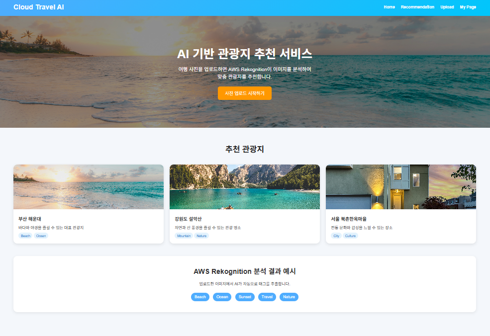

# AWS Food Recommendation Service
Cloud-based food recommendation web service using AWS Rekognition



---

# A. 프로젝트 명

AWS Rekognition 기반 음식 사진 맛집 추천 서비스

---

# B. 프로젝트 멤버 및 담당 역할

- 김도완 : Frontend(UI/UX) 개발, 웹 페이지 구성 및 API 연동
- 박영주 : Backend 서버 개발 및 추천 로직 구현 (Flask API)
- 임나빈 : AWS 클라우드 인프라 구성 (EC2, S3, Lambda), Docker 배포 환경 구축

---

# C. 프로젝트 소개

본 프로젝트는 사용자가 음식 이미지를 업로드하면 AWS Rekognition을 활용하여 음식 이미지를 분석하고, 해당 결과를 기반으로 관련 맛집을 추천해주는 클라우드 기반 웹 서비스이다.

사용자는 별도의 검색어 입력 없이 이미지 업로드만으로 음식 정보를 자동으로 인식하고, 추천 결과 및 업로드 기록을 확인할 수 있다.

---

# D. 프로젝트 필요성

기존 맛집 검색 서비스는 사용자가 음식명이나 키워드를 직접 입력해야 하는 불편함이 존재한다.  

본 프로젝트는 이러한 문제를 해결하기 위해 AI 이미지 인식을 활용하여 **비언어적 입력(이미지)** 기반으로 추천 시스템을 구현하였다.

이를 통해 다음과 같은 장점이 있다:

- 검색 과정 단순화
- 사용자 경험 개선
- AI 기반 개인화 추천 가능
- 클라우드 기반 확장성 확보

---

# E. 관련 기술 / 논문 / 특허 조사

## 1. AWS Rekognition
- 이미지 내 객체 및 음식 카테고리 자동 분석
- 딥러닝 기반 CNN 모델 활용

## 2. 클라우드 기반 추천 시스템
- 사용자 행동 데이터 및 이미지 기반 추천 시스템 연구
- Amazon Personalize 및 협업 필터링 기법 참고

## 3. RESTful API 설계
- 클라이언트-서버 구조 기반 데이터 처리 방식
- JSON 기반 데이터 통신

## 4. Docker & AWS Cloud Architecture
- 컨테이너 기반 배포 환경 구성
- MSA(Micro Service Architecture) 구조 참고

---

# F. 프로젝트 개발 결과물 및 시스템 구조

## 1. 주요 기능
- 음식 이미지 업로드
- AWS Rekognition 기반 이미지 분석
- 음식 카테고리 자동 분류
- 카테고리 기반 맛집 추천
- 업로드 기록 저장 및 조회
- 결과 페이지 UI 제공

---

## 2. 시스템 아키텍처


```text
사용자 이미지 업로드
↓
EC2 (Flask Web Server)
↓
S3 (이미지 저장)
↓
Lambda (자동 트리거)
↓
AWS Rekognition (이미지 분석)
↓
음식 카테고리 추출
↓
RDS (데이터 저장)
↓
맛집 추천 로직 실행
↓
Frontend 결과 페이지 출력
